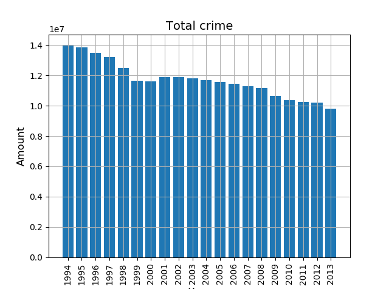
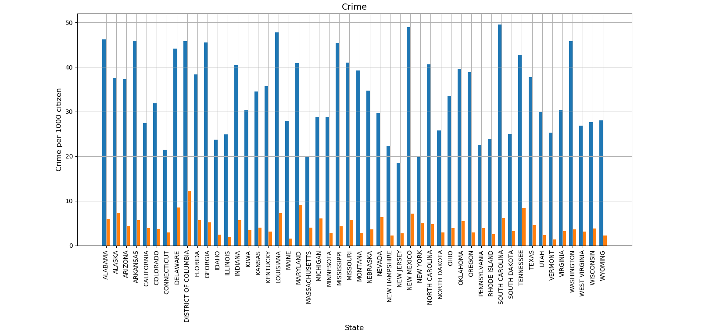

# Impossible Technology

## David Martin Carl, Tjalfe Jon Klarskov Møller, Anton Kornholt & Kasper Ravn Breindal

### Dataset

[Python_FBI_Dataset](https://github.com/menjaw/Python_FBI_Dataset)

### Dependencies & how to run

The following dependencies should be installed in your system, either via `conda install` or `pip install`

```python
import xlrd
import matplotlib
import numpy
```

Clone this project, and `python Assignment2/run.py` to run the project.

### Images

Image 1


Image 2


Image 3


(Orange is violent type, blue is property type)
### Questions

1. Has the crime decreased or increased over the last 20 years?
2. Has the type of crime changed?
3. Has the crime moved to from one area to another?
4. Is there a connection between type of crimes and locations?
5. Which year was the most crime and what crime occured most times?

### Answers

1. As seen in image 1, the crime has generally decreased over the last 20 years.
2. Motor Vehicle Theft has gone down. Otherwise, every type of crime seem to correspond percentwise over all the years, meaning that the types of crime has not changed very much, but that the general number of crimes has gone significantly down.
3. We were informed, that this was to be answered with datasheet #2. But since that sheet only contains data about one year, there is no real answer to be found here. We needed a data source that has both timewise data and locationwise data.
4. As seen in image 3, the states that tend to have a lower amount of violent type of crimes also tend to have a lower property type of crime. But it isnt determined to be that way.
5. 1994 had the most crime, as seen in image 2. The most normal crime was theft.
