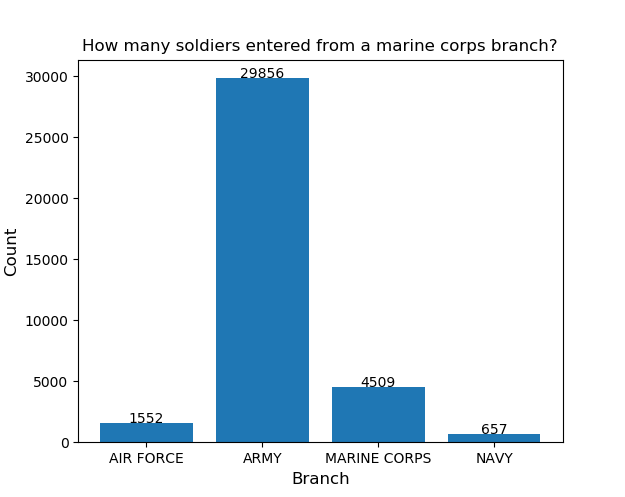
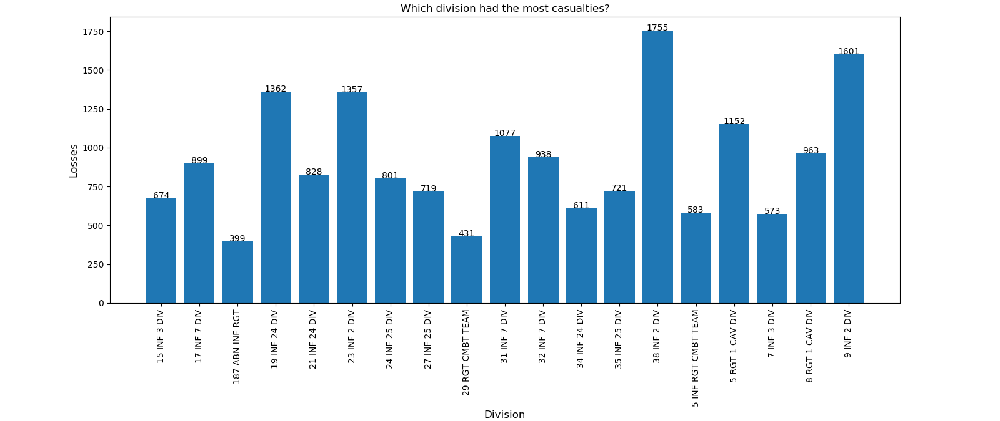
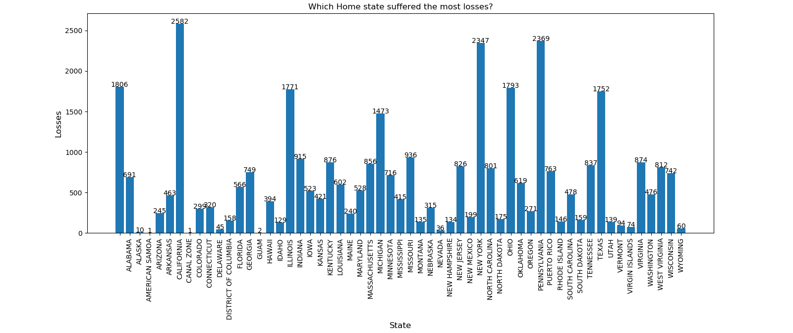

# Impossible Technology

## David Martin Carl, Tjalfe Jon Klarskov Møller, Anton Kornholt & Kasper Ravn Breindal

### Dataset

[KoreanConflict](https://github.com/PatrickFenger/pythonAssignments) or How to use numpy.unique

### Dependencies & how to run

The following dependencies should be installed in your system, either via `conda install` or `pip install`

```python
import pandas
import matplotlib
import numpy
```

The dataset is pre-downloaded.
Clone this project, and `python Assignment3/run.py` to run the project.

### Images

Image 1


Image 2


Image 3


Image 4


Image 5



### Questions

1. How many soldiers entered from a marine corps branch?
2. Which enrollment was the most common?
3. Was there an ethnicity majority throughout the war - If so, which?
4. Which division had the most casualties?
5. Which Home state suffered the most losses?

### Answers

1. 29856 soldiers from the marine coprs entered the conflict, see image 1.
2. Active - regular, see image 2.
3. Yes, there was a majority. White was the most prevalent ethnicity. See image 3.
4. the 38th infantry 2nd division lost the most people. See image 4.
5. California lost the most soldiers. Closely followed by Pennsylvania and New York. See image 5.
