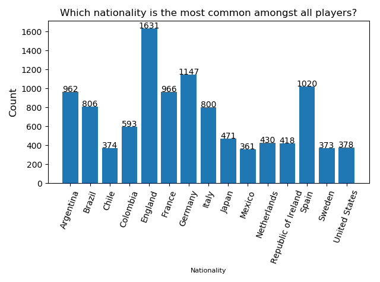

# Impossible Technology

## David Martin Carl, Tjalfe Jon Klarskov Møller, Anton Kornholt & Kasper Ravn Breindal

### Dataset

[FIFA18players](https://raw.githubusercontent.com/INFINITE-KH/Python-Dataset/master/complete.csv)

### Dependencies & how to run

The following dependencies should be installed in your system, either via `conda install` or `pip install`

```python
import pandas
import matplotlib
import numpy
```

Clone from git repository and run the project from command promt with the command line:

`python run.py`

Or by opening the run file in your chosen environment and running the file.

Our run.py file contains a webget that downloads the dataset upon running the file. 

### Images

Question 2


Question 4


### Questions

Question 1: The 3 most expensive teams and the 3 cheapest teams according to player value.

Question 2: Which nationality is the most frequent amongst all players

Question 3: What is the difference between the release clause and the value of top 10 most valuable players

Question 4: What is the frequency of age, height and weight for all players

Question 5: How big is the average difference between value and wage of the players

### Answers

1. 3 Most expensive teams are: 
* FC Barcelona
* FC Bayern Munich
* Real Madrid CF

3 cheapest teams are: 
* Bray Wanderers
* Limerick FC
* Drogheda United

2. England is the most common nationality. See image "question 2" for overview.

3. The difference between release clause and value of the 10 most valueable players.

* Neymar:       113,800,000.0 EUR.

* L. Messi:     110,300,000.0 EUR.

* L. Suarez:    101,900,000.0 EUR.

* Cristiano:    100,300,000.0 EUR.

* R. Lewand:    59,800,000.0 EUR.

* E. Hazard:    83,700,000.0 EUR.

* K. De Bru:    76,800,000.0 EUR.

* T. Kroos:     83,000,000.0 EUR.

* P. Dybala:    57,300,000.0 EUR.

* G. Higuan:    50,100,000.0 EUR.

4. See the images in section "question 3" for an overview of the frequencies.

5. The average difference between player wages and values are: 2359007 EUR
