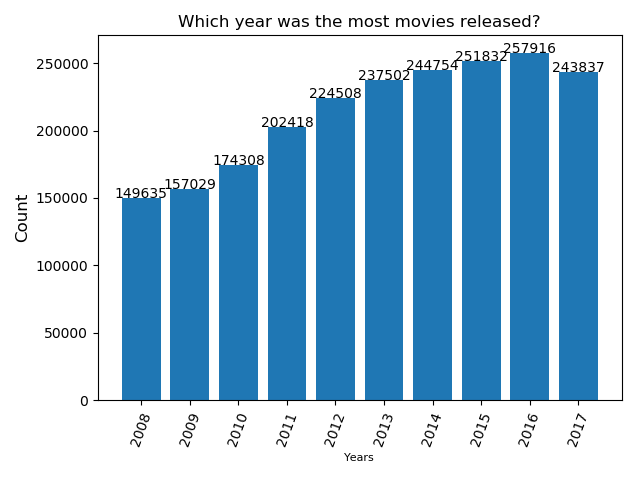
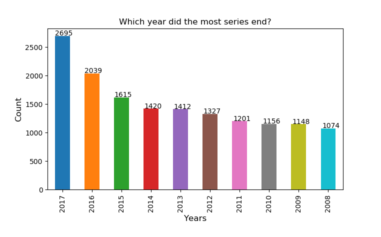
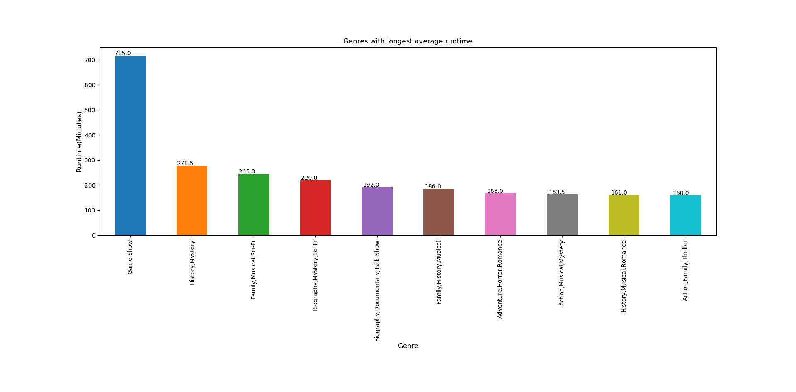
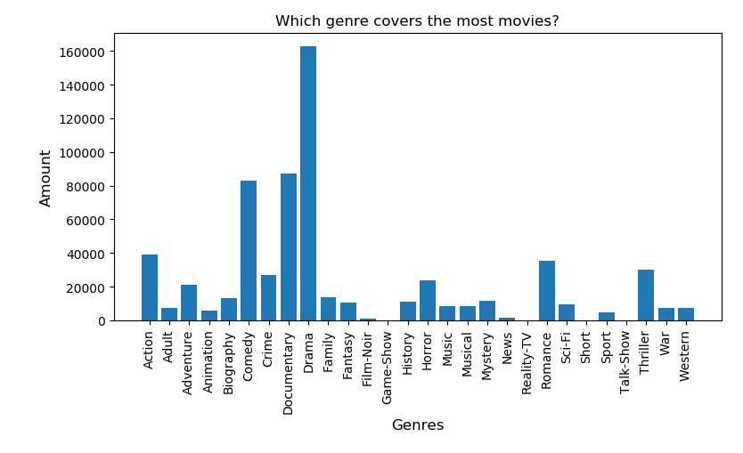

# Impossible Technology

## David Martin Carl, Tjalfe Jon Klarskov Møller, Anton Kornholt & Kasper Ravn Breindal

### Dataset

[IMDB Titles dataset](https://datasets.imdbws.com/title.basics.tsv.gz)

### Dependencies & how to run

The following dependencies should be installed in your system, either via `conda install` or `pip install`

```python
import pandas
import matplotlib
import numpy
import gzip
```

Clone from git repository, `cd Assignment5` and run the project from command promt with the command line:

`python run.py`

Or by opening the run file in your chosen environment and running the file.

Our run.py file contains a webget that downloads the dataset upon running the file. 

Our answer to question 4 takes a while. Don't worry it has not crashed - give it time!

### Images

#### Question 1



#### Question 2



#### Question 3



#### Question 4




### Questions

Question 1: Which year was the most movies released?

Question 2: Which year was most series ended?

Question 3: Which genres has the longest runtime per movies?

Question 4: Which genre covers the most movies?

Question 5: What is the average runtime on adult films?

### Answers

1. 2016 is the year with the most releases, see image 1.

2. 2017 is the result we found. See image 2.

3. The "Gameshow" genre has the longest average runtime. See Image 3.

4. Drama has the most movies in the dataset. See Image 4.

5. Average runtime on adult films is 104.74 minutes.
