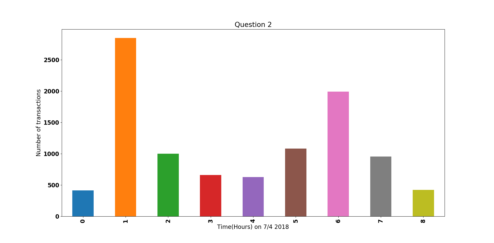

I renamed the size column in the CSV file because otherwise pandas wouldnt not function correctly. I renamed it from 'size' to 'sizetransfer'

# Impossible Technology

## David Martin Carl, Tjalfe Jon Klarskov Møller, Anton Kornholt & Kasper Ravn Breindal

### Dataset

[IMDB Titles dataset](https://datasets.imdbws.com/title.basics.tsv.gz)

### Dependencies & how to run

The following dependencies should be installed in your system, either via `conda install` or `pip install`

```python
import pandas
import matplotlib
import numpy
```

Clone from git repository, `cd Assignment7` and run the project from command promt with the command line:

`python run.py`

Or by opening the run file in your chosen environment and running the file.

### Images

#### Question 2



### Questions

Question 1: What is the transaction with the highest volume in the timespan?

Question 2: What is the average number of transactions per hour (would look nice like a graph)?

Question 3: What is the most favourite; selling or buying?

Question 4: What is the average sale and buy price per day for the most bought currency?

Question 5: What is the total volume per day (graph)?

### Answers

1. 29.38

2. The hours with the most transactions can be seen in the bar plot with the title 'Question 2' 

3. 5075 bought and 4925 sold. So buying was the favorite.

4. 6627.70 for both buying and selling makes sense as whatever someone is selling another one is buying.

5. ?
