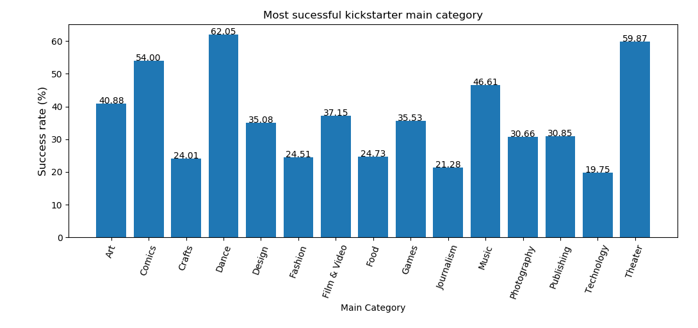
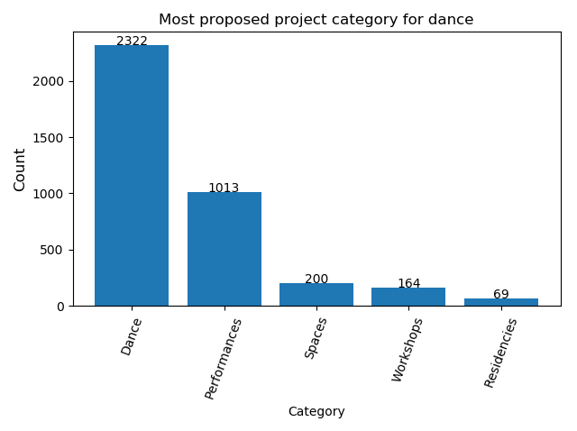
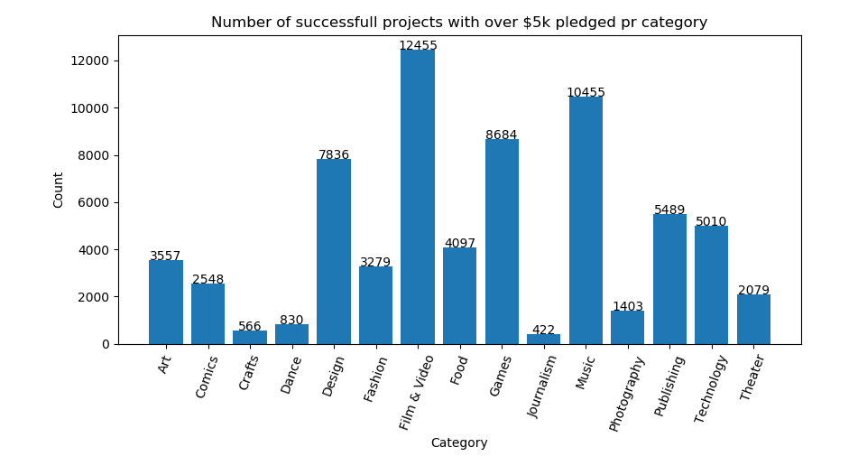

# Impossible Technology

## David Martin Carl, Tjalfe Jon Klarskov Møller, Anton Kornholt & Kasper Ravn Breindal

### Dataset

[Kickstarter Data](https://github.com/mathiasjepsen/PythonDatasetAssignment)

### Dependencies & how to run

The following dependencies should be installed in your system, either via `conda install` or `pip install`

```python
import pandas
import matplotlib
import numpy
```

Clone from git repository, `cd Assignment8` and run the project from command promt with the command line:

`python run.py`

Or by opening the run file in your chosen environment and running the file.

The size column in the CSV file was renamed because otherwise pandas would not function correctly. It was renamed from 'size' to 'sizetransfer'

### Images

#### Question 1



#### Question 2



#### Question 4



### Questions

Question 1: What main-category of project has the highest success rate?

Question 2: For the main-category of project with highest success rate (question above), what is the category with the highest number of project proposals?

Question 3: What is the median pledged amount (usd_pledged_real) of successfully funded projects?

Question 4: What is the number of successfully funded projects with more than 5.000$ pledged (usd_pledged_real) per category?

Question 5: For the main-category with the most successfully funded projects (quantity, not rate of success), what is the goal-amount range (usd_goal_real), e.g. range 0-10k$ , 5-15k$, 100k$-110k$, that contains the most successfully funded projects (in quantity, not rate of success)?

### Answers

1. "Dance" has the highest successrate with 62.05% funded. See Image 1.

2. Subcategory "Dance" of "Dance" (yeah i know) has the highest number of proposals. See Image 2.

3. The median pledged of successful projects is $5107.25

4. This is very different based on genre. See image 3 for a graph. "Film and Video" is the largest/most popular by a fair bit.

5. pass
