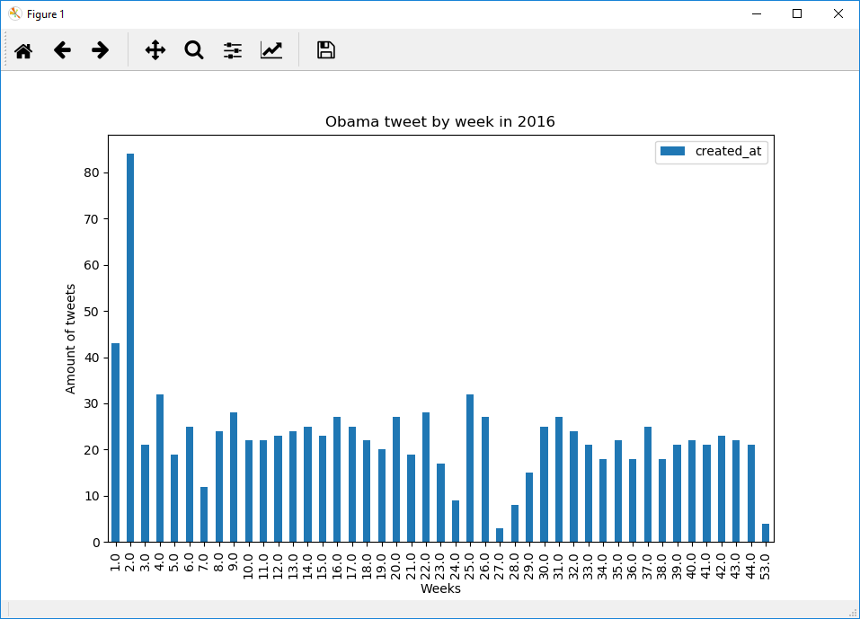
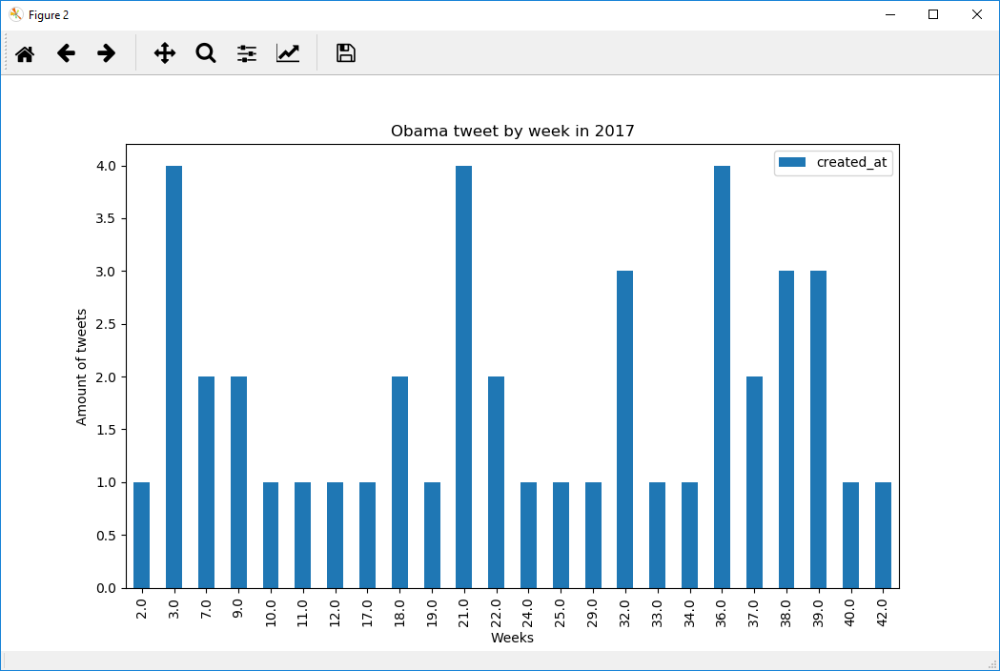
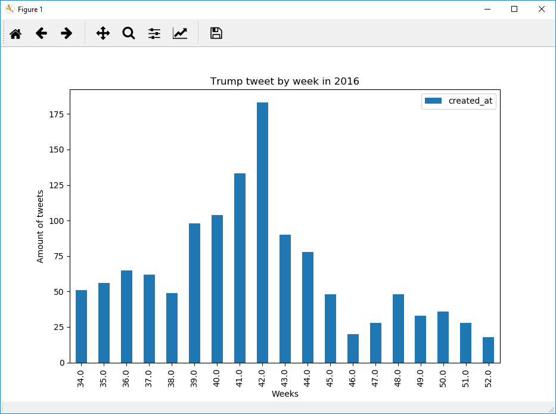
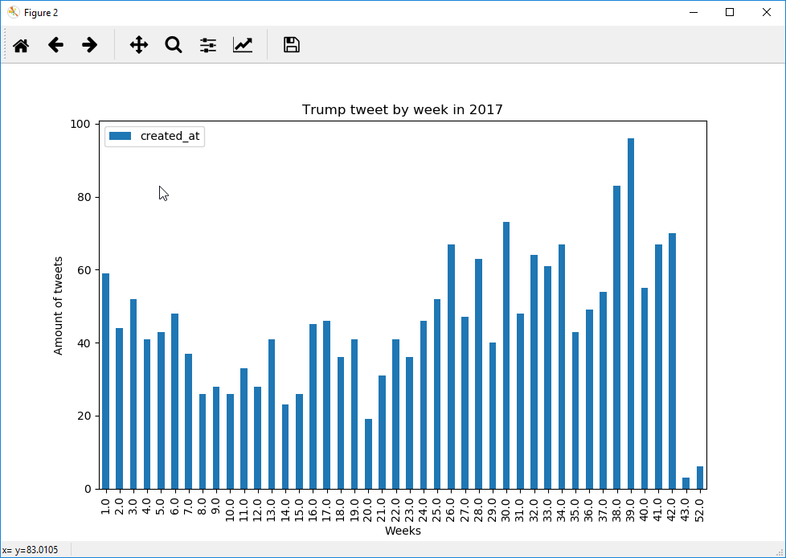
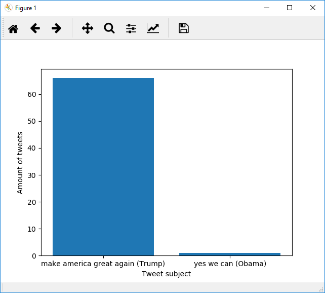
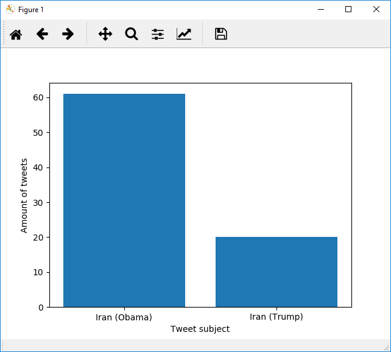
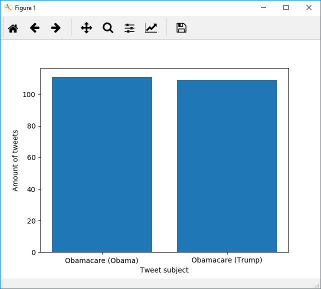

# Impossible Technology

## David Martin Carl, Tjalfe Jon Klarskov Møller, Anton Kornholt & Kasper Ravn Breindal

### Dataset

[Twitter Datasets](https://github.com/Gozzah/Dataset)

### Dependencies & how to run

The following dependencies should be installed in your system, either via `conda install` or `pip install`

```python
import pandas
import matplotlib
import numpy
```

Clone from git repository, `cd Assignment9` and run the project from command promt with the command line:

`python run.py`

Or by opening the run file in your chosen environment and running the file.


### Images

#### Question 1





#### Question 2





#### Question 3



#### Question 4



#### Question 5



### Questions

Question 1: How many tweets did Trump make weekly during the years 2016-2017?

Question 2: How many tweets did Obama make weekly during the years 2016-2017?

Question 3: How many times have the two presidents, ever tweeted their slogans? (make america great again, yes we can) Find the amount for each president, respectively

Question 4: Which president mentions "Iran" the most?

Question 5: How many times do both presidents mention "obamacare", respectively?

### Answers

1. Obamas tweets per week in 2016 and 2017 can be seen in the two corresponding bar plots

2. Trump tweets per week in 2016 and 2017 can be seen in the two corresponding bar plots

3. Obama wrote 'yes we can' 1 time in the data set
Trump wrote 'make america great again!' 62 times in the data set

4. Obama wrote 'Iran' 61 time in the data set
Trump wrote 'Iran' 20 times in the data set

5. Obama wrote 'Obamacare' 111 time in the data set
Trump wrote 'Obamacare' 109 times in the data set
